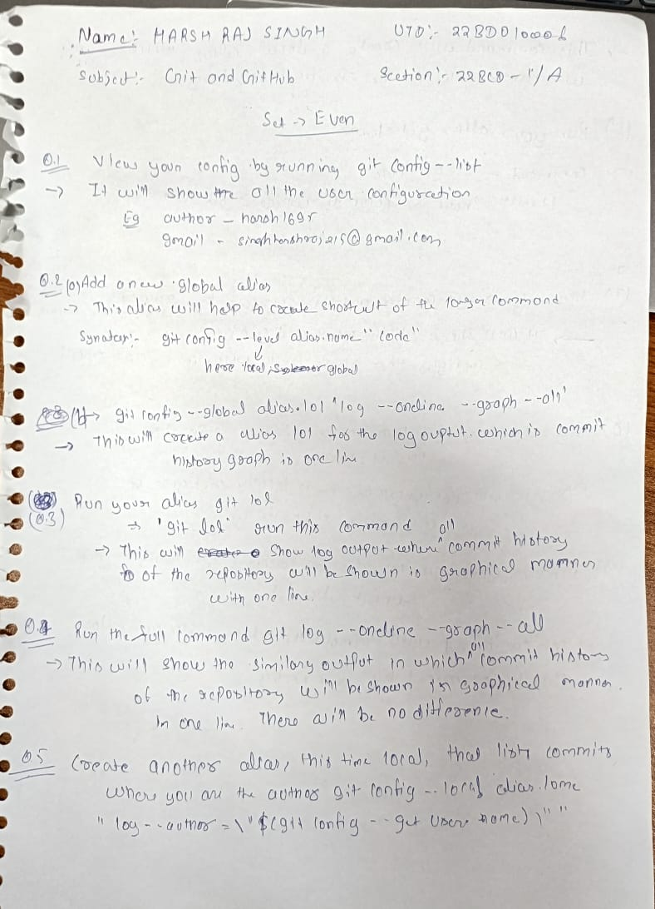
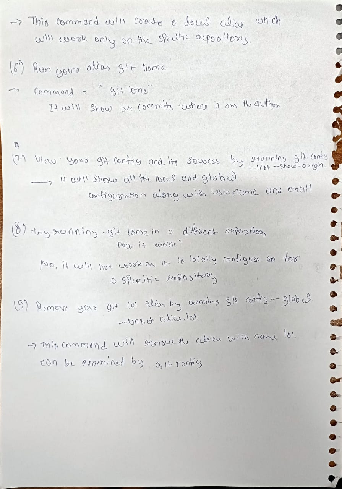
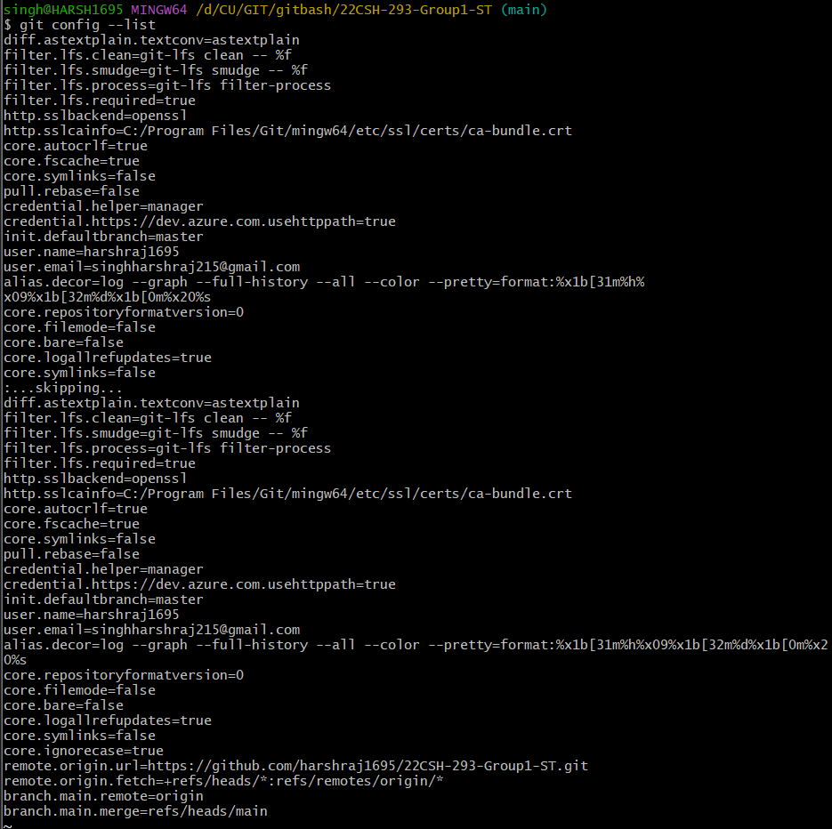
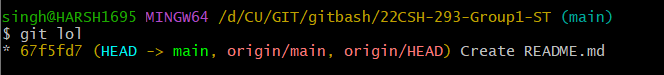
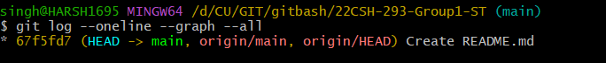
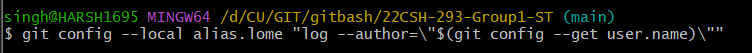
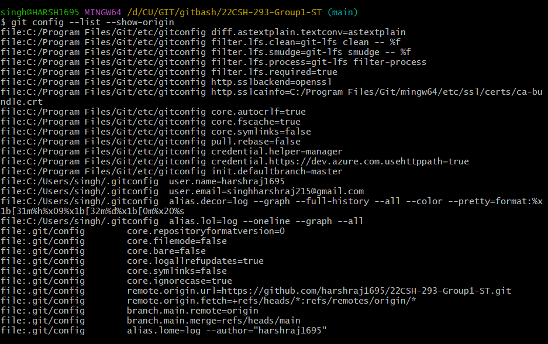
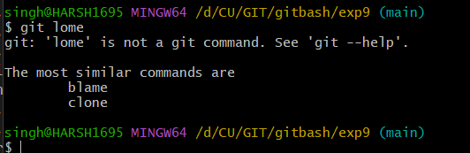
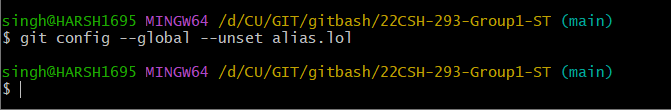

# Harsh Raj Singh (EVEN Set)
## Hard Copy Solution

### (Q.1)View your config by running git config --list

### (Q.2)Add a new global alias
### git config --global alias.lol 'log --oneline --graph --all'
### This allows you to call git lol as an alternative to git log --oneline --graph --all

### (Q.3) Run your alias git lol

### (Q.4) Run the full command git log --oneline --graph --all
### Are there any difference in the output?

### (Q.5) Create another alias, this time local, that lists commits where you are the author
### git config --local alias.lome "log --author=\"$(git config --get user.name)\""

### (Q.6) Run your alias git lome
### What does it show?

### (Q.7) View your git config and its sources by running git config --list --show-origin
### Can you find your alias configurations?

### (Q.8) Try running git lome in a different git repository
### Does it work?

### (Q.9) Remove your git lol alias by running git config --global --unset alias.lol

